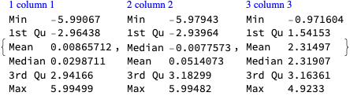

# Quantile regression 3D examples

Anton Antonov   
[MathematicaForPrediction at WordPress](http://mathematicaforprediction.wordpress.com)   
[MathematicaForPrediction at GitHub](https://github.com/antononcube/MathematicaForPrediction)   
May 2023

## Introduction

In this notebook we develop in detail [Quantile Regression](https://en.wikipedia.org/wiki/Quantile_regression) (QR) examples over 3D data via the functions of the paclet “[AntonAntonov/QuantileRegression”](https://resources.wolframcloud.com/PacletRepository/resources/AntonAntonov/QuantileRegression/), [AAp1].

The QR examples demonstrate using:

1. [QuantileRegression](https://resources.wolframcloud.com/PacletRepository/resources/AntonAntonov/QuantileRegression/ref/QuantileRegression.html) with "automatic", [NURBS](https://en.wikipedia.org/wiki/Non-uniform_rational_B-spline) functions (created via `BSplineFunction`.)

1. [QuantileRegressionFit](https://resources.wolframcloud.com/PacletRepository/resources/AntonAntonov/QuantileRegression/ref/QuantileRegressionFit.html) with custom made basis functions

**Remark:** In order to get a better idea of the how the data looks like, use the 3D graphics interactivity feature rotation. 

**Remark:** This notebook automatically installs the paclet “[AntonAntonov/QuantileRegression"](https://resources.wolframcloud.com/PacletRepository/resources/AntonAntonov/QuantileRegression/), [AAp1] -- see the section “Preparation” below.

**Remark:** A version of this notebook is a technical note in the paclet ["AntonAntonov/QuantileRegression"](https://resources.wolframcloud.com/PacletRepository/resources/AntonAntonov/QuantileRegression/), [AAp1].


------ 

## First neat example

This section has a first neat example with data with triangular domain.

Generate noisy 3D data:

```mathematica
Block[{c = 2, h = 0.1}, 
  data = Flatten[Table[{x, y, Exp[-(x^2 + y^2)/4]*(1 + RandomReal[1.2])}, {x, -c, c, h}, {y, x, c, h}], 1]; 
 ]
```

Compute Quantile regression for probabilities $0.1$ and $0.9$:

```mathematica
probs = {0.1, 0.9};
AbsoluteTiming[
  funcs = AssociationThread[probs -> QuantileRegression[data, 4, probs]]; 
 ]

(*{0.205853, Null}*)
```

Plot the data points and regression quantiles together:

```mathematica
reg = ConvexHullRegion[Most /@ data];
QRPlot3D[data, funcs, RegionFunction -> Function[{x, y}, RegionMember[reg, {x, y}]]]

```


------ 

## Noisy arrow wave

Generate random, "noisy wave" data:

```mathematica
{b, c} = {-6, 6};
data = RandomReal[{b, c}, {1200, 2}];
data = Map[Append[#, Sqrt[#[[1]] - b] + Sin[#[[1]] + Abs[#[[2]]]] + RandomVariate[NormalDistribution[0, 0.3]]] &, data];
Dimensions[data]

(*{1200, 3}*)
```

3D list plot of the data:

```mathematica
ListPointPlot3D[data, PlotRange -> All, PlotLabel -> "Noisy wave data", BoxRatios -> {1, 1, 2/3}, ImageSize -> Medium]
```


Data summary:

```mathematica
ResourceFunction["RecordsSummary"][data]
```



Compute Quantile regression for probability 0.5 using a grid of `7*4` NURBS basis functions:

```mathematica
AbsoluteTiming[
  funcs = QuantileRegression[data, {7, 4}, 0.5]; 
 ]

(*{0.379605, Null}*)
```

Plot the obtained function and data:

```mathematica
QRPlot3D[data, <|0.5 -> First[funcs]|>]
```


Quantile regression for probabilities 0.1 and 0.9:

```mathematica
probs = {0.1, 0.9};
AbsoluteTiming[
  funcs = AssociationThread[probs, QuantileRegression[data, {7, 4}, probs]]; 
 ]

(*{0.591367, Null}*)
```

3D list plot of the data:

```mathematica
QRPlot3D[data, funcs]
```


Count the number of points under each surface:

```mathematica
sepPoints = Map[Function[{f}, Length@Select[data, #[[-1]] < First[Apply[f, Most[#]]] &]], funcs]

(*<|0.1 -> 120, 0.9 -> 1087|>*)
```

Show the corresponding fractions (should correspond to the probabilities):

```mathematica
sepFractions = N[sepPoints/Length[data]]

(*<|0.1 -> 0.1, 0.9 -> 0.905833|>*)
```

------ 

## Square sombrero

In this section we show the use of [QuantileRegressionFit](https://reference.wolfram.com/language/AntonAntonov/QuantileRegression/ref/QuantileRegressionFit) over a pre-generated basis functions. 

**Remark:** The QR computational steps below correspond to the implementation of [QuantileRegression](https://reference.wolfram.com/language/AntonAntonov/QuantileRegression/ref/QuantileRegression) .

Generate random, "square sombrero" data:

```mathematica
{b, c} = {-6, 6};
data = RandomReal[{b, c}, {1200, 2}];
data = Map[Append[#, Exp[-# . #/(c - b)/2] (Sin[Abs[#[[1]]] + Abs[#[[2]]]] + RandomVariate[NormalDistribution[0, 0.2]])] &, data];
Dimensions[data]

(*{1200, 3}*)
```

3D list plot of the data:

```mathematica
ListPointPlot3D[data, PlotRange -> All, PlotLabel -> "Square sombrero data", BoxRatios -> {1, 1, 1/1.5}, ImageSize -> Medium]
```


Data summary:

```mathematica
ResourceFunction["RecordsSummary"][data]
```


NURBS basis of `12*12` functions:

```mathematica
basis = NURBSBasis[data[[All, 1 ;; 2]], 12];
Length[basis]

(*144*)
```

Quantile regression for probability 0.9:

```mathematica
probs = {0.9};
AbsoluteTiming[
  funcs = AssociationThread[probs, QuantileRegressionFit[data, Through[Values[basis][x, y]], {x, y}, probs]]; 
 ]
```


```
(*{6.53867, Null}*)
```

Plot functions and data:

```mathematica
QRPlot3D[data, ToPureFunctions[funcs, {x, y}], ColorFunction -> (Lighter[Blue] &), PlotLegends -> SwatchLegend[{Lighter[Blue]}, Keys[funcs]], Exclusions -> None]
```


------ 

## Pyramid basis

In this section we demonstrate the use of custom made basis functions.

Define a pyramid basis function:


Here is a plot of a basis function:

```mathematica
Plot3D[PyramidBasisFunc[{0, 0}, {x, y}], {x, -1.5, 1.5}, {y, -1.5, 1.5}, PlotRange -> All, ImageSize -> Medium]
```


Make a basis for the sombrero data:

```mathematica
basis = Flatten@Table[PyramidBasisFunc[{i, j}, {x, y}], {i, b, c}, {j, b, c}];
Length[basis]

(*169*)
```

Find regression quantiles for probability 0.2:

```mathematica
probs = {0.2};
AbsoluteTiming[
  funcs = 
    AssociationThread[
     probs, QuantileRegressionFit[data, basis, {x, y}, probs, Method -> {LinearProgramming, Method -> "InteriorPoint"}]]; 
 ]

(*{0.866452, Null}*)
```

Plot data and regression quantiles together:

```mathematica
QRPlot3D[data, ToPureFunctions[funcs], ColorFunction -> (Lighter[Blue] &), Mesh -> True, PlotLegends -> SwatchLegend[{Lighter[Blue]}, Keys[funcs]], Exclusions -> None]
```


------ 

## Partial sombrero

In this section we demonstrate the built-in basis filtering in the function [NURBSBasis](https://reference.wolfram.com/language/AntonAntonov/QuantileRegression/ref/NURBSBasis). The basis filtering is used to alleviate (or diminish) fitting problems for data that partially occupies the functional basis domain.

**Remark:** For a more detailed discussion of how basis filtering is implemented and how it addresses “partial data occupation” problems see the section “Possible issues” of the function page for [NURBSBasis](https://resources.wolframcloud.com/PacletRepository/resources/AntonAntonov/QuantileRegression/ref/NURBSBasis.html).

Generate random, "partial sombrero" data:

```mathematica
{b, c} = {-6, 6};
data = RandomReal[{b, c}, {1600, 2}];
sombreroFunc = Exp[-# . #/(c - b)/4]*Sin[Sqrt[#[[1]]^2 + #[[2]]^2]] &;
data = Map[Append[#, sombreroFunc[##]*(1 + RandomVariate[NormalDistribution[0, 0.6]])] &, data];
Dimensions[data]

(*{1600, 3}*)
```

3D list plot of the data:

```mathematica
data2 = Select[data, #[[1]] <= 0.5*#[[2]] &];
ListPointPlot3D[data2, PlotLabel -> "Partial sombrero data", BoxRatios -> {1, 1, 2/3}, ImageSize -> Medium]
```


Regression quantiles:

```mathematica
probs = {0.1, 0.9};
AbsoluteTiming[
  funcs = AssociationThread[probs, QuantileRegression[data2, 5, probs]]; 
 ]

(*{0.295488, Null}*)
```

Plot data and regression quantiles together:

```mathematica
QRPlot3D[data2, funcs]
```


Create a region object for the convex hull of the data points:

```mathematica
reg = ConvexHullRegion[data2[[All, 1 ;; 2]]]
```


The plot data and regression quantiles over the region above:

```mathematica
QRPlot3D[data2, funcs, RegionFunction -> Function[{x, y}, RegionMember[reg, {x, y}]]]
```


Count the number of points under each surface:

```mathematica
sepPoints = Map[Function[{f}, Length[Select[data2, #[[-1]] < (f @@ Most[#])[[1]] &]]], funcs]

(*<|0.1 -> 91, 0.9 -> 731|>*)
```

Show the corresponding fractions (should correspond to the probabilities):

```mathematica
sepFractions = N[sepPoints/Length[data2]]

(*<|0.1 -> 0.112485, 0.9 -> 0.903585|>*)
```

------ 

## Preparation

Install the paclet:

```mathematica
PacletInstall["AntonAntonov/QuantileRegression"]
```

Load the Quantile regression paclet:

```mathematica
Needs["AntonAntonov`QuantileRegression`"]
```

Set random seed:

```mathematica
SeedRandom[9903];
```

Define plot function:

```mathematica
QRPlot3D[data_List, funcs_Association, opts___] := 
   Show[
    ListPointPlot3D[data, FilterRules[{opts}, {{BoxRatios -> {1, 1, 1/1.5}}}], {BoxRatios -> {1, 1, 1/1.5}}, PlotStyle -> Red, PlotRange -> All], 
    Plot3D[Evaluate@Through[Values[funcs][x, y]], {x, Min[data[[All, 1]]], Max[data[[All, 1]]]}, {y, Min[data[[All, 2]]], Max[data[[All, 2]]]}, 
     opts, 
     PlotRange -> All, PlotStyle -> {Opacity[0.7]}, Mesh -> True, PlotTheme -> "LightMesh", PerformanceGoal -> "Quality", PlotLegends -> Keys[funcs]], ImageSize -> Medium];
```

Define pure functions converter:

```mathematica
ToPureFunctions[funcs_, vars_List : {x, y}] := 
   Map[With[{f = #}, f &] &, ReplaceAll[funcs, Thread[vars -> Map[Slot, Range[Length[vars]]]]]];
```

------ 

## References

### Articles

[Wk1] Wikipedia entry, [Quantile regression](https://en.wikipedia.org/wiki/Quantile_regression).

[Wk2] Wikipedia entry, [NURBS](https://en.wikipedia.org/wiki/Non-uniform_rational_B-spline).

[AA1] Anton Antonov, 
["Quantile regression through linear programming"](https://mathematicaforprediction.wordpress.com/2013/12/16/quantile-regression-through-linear-programming/), 
(2013), 
[MathematicaForPrediction at WordPress](https://mathematicaforprediction.wordpress.com).

[AA2] Anton Antonov, 
["Quantile regression with B-splines"](https://mathematicaforprediction.wordpress.com/2014/01/01/quantile-regression-with-b-splines/), 
(2014), 
[MathematicaForPrediction at WordPress](https://mathematicaforprediction.wordpress.com).

### Books

Roger Koenker, (2005). *Quantile Regression* (Econometric Society Monographs). 2005. Cambridge: Cambridge University Press. 
[doi:10.1017/CBO9780511754098](https://www.amazon.com/Quantile-Regression-Econometric-Society-Monographs/dp/0521608279)

### Functions, packages, paclets

[AAf1] Anton Antonov, 
[QuantileRegression](https://resources.wolframcloud.com/FunctionRepository/resources/QuantileRegression/), 
(2019), 
[Wolfram Function Repository](https://resources.wolframcloud.com/FunctionRepository/).

[AAp1] Anton Antonov, 
[QuantileRegression paclet](https://resources.wolframcloud.com/PacletRepository/resources/AntonAntonov/QuantileRegression/ref/QuantileRegression.html), 
(2023), 
[Wolfram Language Paclet Repository](https://resources.wolframcloud.com/PacletRepository/).

[AAp2] Anton Antonov, 
[QuantileRegression Mathematica package](https://github.com/antononcube/MathematicaForPrediction/blob/master/QuantileRegression.m), 
(2013-2023), 
[MathematicaForPrediction at GitHub](https://github.com/antononcube/MathematicaForPrediction).

### Videos

[AAv1] Anton Antonov, 
["Quantile Regression—Theory, Implementations, and Applications"](https://www.youtube.com/watch?v=GddvdXMJV9Y), 
(2014), 
[Wolfram channel at YouTube](https://www.youtube.com/@WolframResearch).
