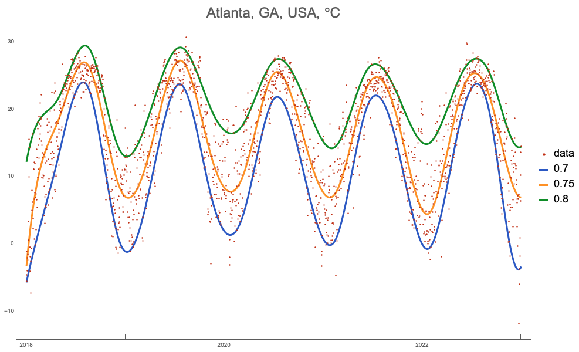
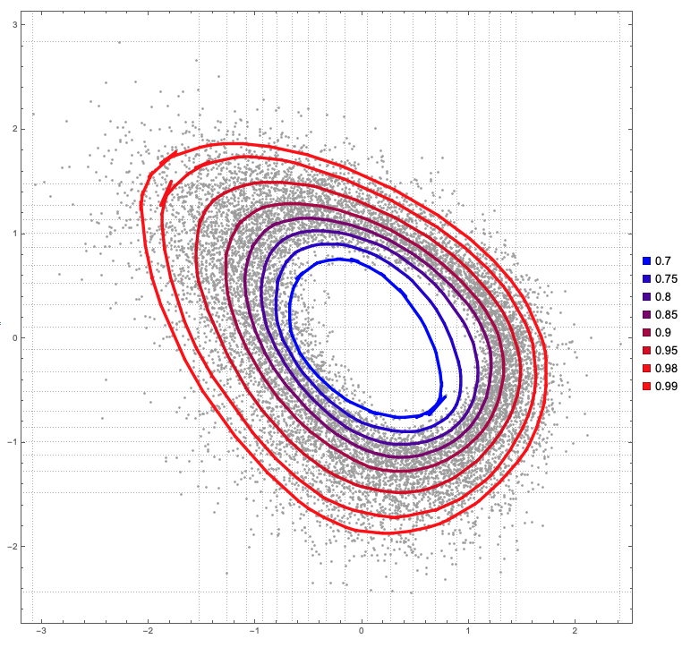
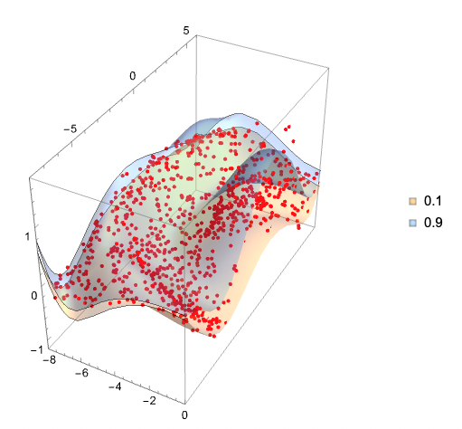

# QuantileRegression WL paclet

Wolfram Language (aka Mathematica) paclet that provides various Quantile Regression functions.

- [`QuantileRegression`](https://resources.wolframcloud.com/PacletRepository/resources/AntonAntonov/QuantileRegression/ref/QuantileRegression.html) works on time series, lists of numbers and lists of numeric pairs.
- The curves computed with quantile regression are called regression quantiles.
- The regression quantiles corresponding to the specified probabilities are linear combinations of B-splines generated over the specified knots.
- In other words, `QuantileRegression` computes fits using a B-spline functions basis. The basis is specified with the knots argument and the option `InterpolationOrder`.
- `QuantileRegression` takes the following options:

| Option             | Default value | Description                                     | 
|--------------------|---------------|-------------------------------------------------|
| InterpolationOrder | 3             | interpolation order                             |
| LinearProgramming  | Method        | method for the quantile regression computations |

- [`QuantileRegressionFit`](https://resources.wolframcloud.com/PacletRepository/resources/AntonAntonov/QuantileRegression/ref/QuantileRegression.html) is very similar to QuantileRegression but uses a given list of basis functions.
- [`QuantileEnvelope`](https://resources.wolframcloud.com/PacletRepository/resources/AntonAntonov/QuantileRegression/ref/QuantileEnvelope.html) provides experimental implementation of quantile envelopes points finding.
- [`QuantileEnvelopeRegion`](https://resources.wolframcloud.com/PacletRepository/resources/AntonAntonov/QuantileRegression/ref/QuantileEnvelopeRegion.html) provides experimental implementation of 2D or 3D quantile envelope region finding.
- [`NURBSBasis`](https://resources.wolframcloud.com/PacletRepository/resources/AntonAntonov/QuantileRegression/ref/NURBSBasis.html)
  gives a basis of [NURBS](https://en.wikipedia.org/wiki/Non-uniform_rational_B-spline) functions.

-------

## Examples

### Quantile regression of time series

### Quantile envelopes over 2D data

### Quantile regression over 3D data

-------

## References

### Articles

[Wk1] Wikipedia entry, [Quantile regression](https://en.wikipedia.org/wiki/Quantile_regression).

[Wk2] Wikipedia entry, [NURBS](https://en.wikipedia.org/wiki/Non-uniform_rational_B-spline). 

[AA1] Anton Antonov,
["Quantile regression through linear programming"](https://mathematicaforprediction.wordpress.com/2013/12/16/quantile-regression-through-linear-programming/),
(2013),
[MathematicaForPrediction at WordPress](https://mathematicaforprediction.wordpress.com).

[AA2] Anton Antonov,
["Quantile regression with B-splines"](https://mathematicaforprediction.wordpress.com/2014/01/01/quantile-regression-with-b-splines/)m
(2014),
[MathematicaForPrediction at WordPress](https://mathematicaforprediction.wordpress.com).

### Videos

[AAv1] Anton Antonov,
["Quantile Regression—Theory, Implementations, and Applications"](https://www.youtube.com/watch?v=GddvdXMJV9Y),
(2014),
[Wolfram channel at YouTube](https://www.youtube.com/@WolframResearch).
